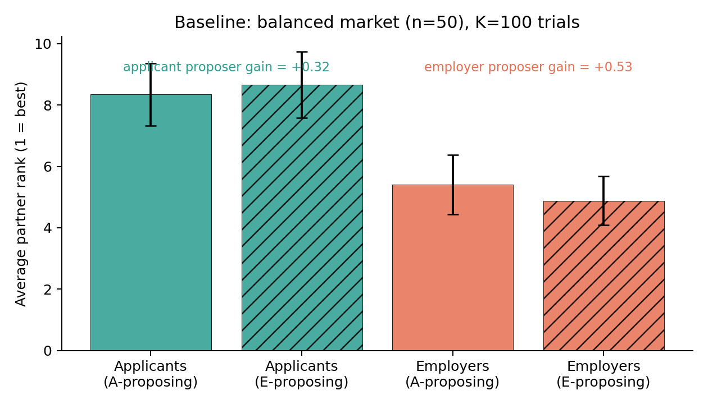
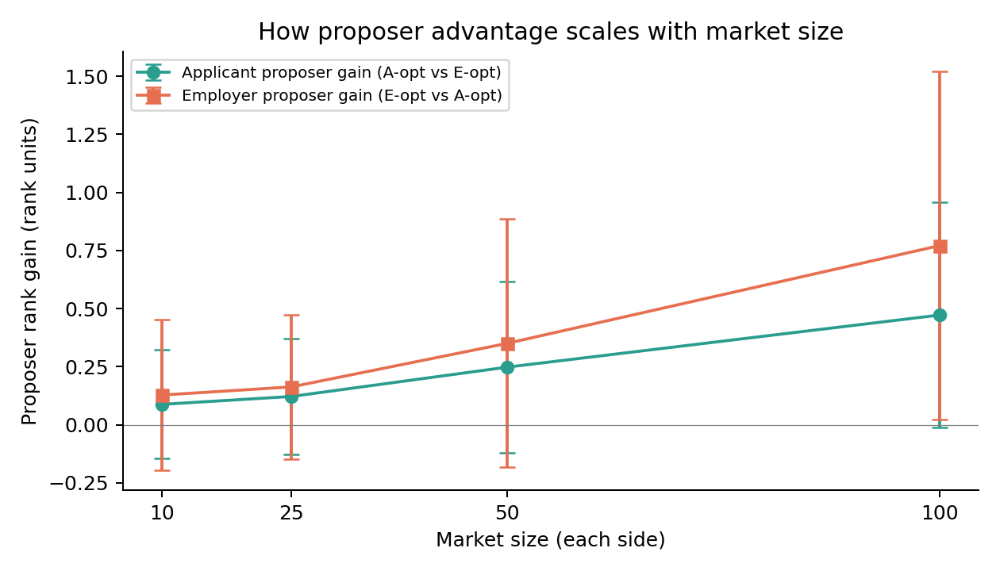
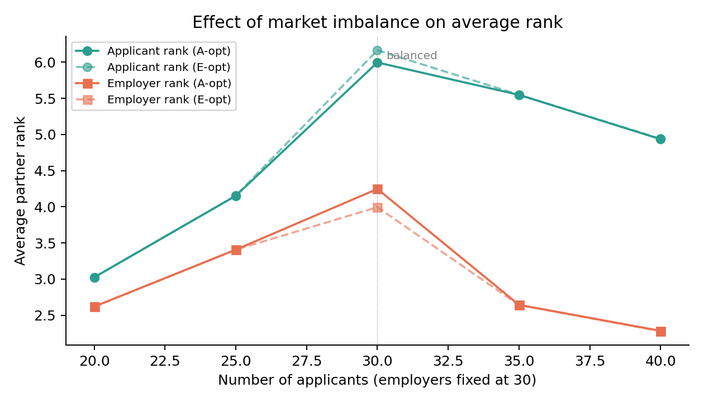
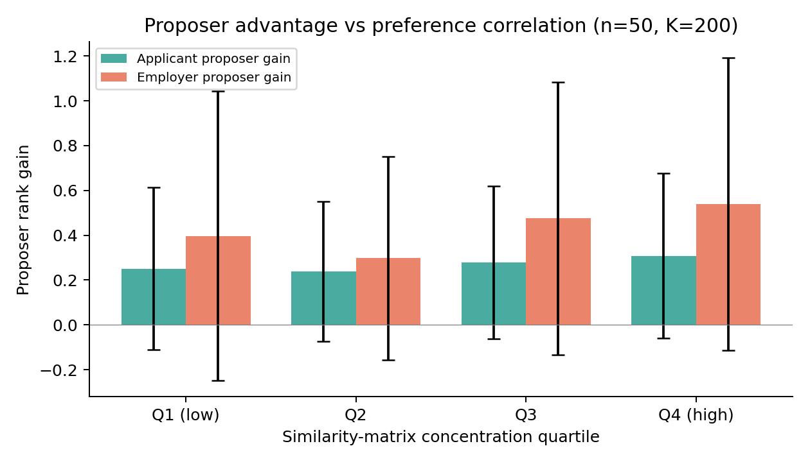

# Comparative Analysis of Proposer Advantage in Stable Matching

*A Decision Analysis course project applying the Gale-Shapley deferred acceptance algorithm to a real two-sided labor market, quantifying the magnitude of the proposer advantage across four experimental settings.*

**Authors:** Vakulich Anastasia (БАСБ251), Roshchina Nadezhda (БАСБ252)
**Course:** Decision Analysis · НИУ ВШЭ
**Repository:** this directory · **Live demo:** [here](https://aavvanna.github.io/decision-analysis/)

---

## 1. Introduction

A two-sided matching market consists of two disjoint sets of agents in which each agent ranks members of the opposite set. Gale & Shapley (1962) showed that the *deferred acceptance* algorithm always produces a **stable matching** — one with no blocking pair — and that the side that proposes obtains the matching which is simultaneously optimal for all proposers across the set of stable matchings (the **proposer-optimality theorem**).

The theorem is structural: it says no proposer can do strictly better in *any* stable matching, and dually, no receiver can do strictly worse. It does not tell us how *large* the advantage is in a given market, which is empirically interesting in markets such as residency matching, school choice, or — in our case — the labor market.

This project measures the magnitude of the proposer advantage on real data and asks how it depends on three structural features of the market: size, side imbalance, and the concentration of preferences.

## 2. Data and methodology

We use two publicly available Kaggle datasets, both in English:

1. **Data Science Job Postings & Skills (2024)** — `asaniczka/data-science-job-postings-and-skills`. 12 217 real LinkedIn postings with comma-separated extracted skill lists. Source for the **employer** side.
2. **Resume Dataset** — `saugataroyarghya/resume-dataset`. 9 544 resumes; each row stores a pre-extracted skill list as a Python-style string. Source for the **applicant** side.

### 2.1 Skill vocabulary and encoding

We build a shared vocabulary `V` of the **80** most frequent skills across all job postings (`python`, `sql`, `machine learning`, `data analysis`, …). Each employer is encoded as a binary vector `e ∈ {0,1}^{80}` from its labelled skill list, intersected with `V`. Each applicant is encoded as `a ∈ {0,1}^{80}` from the parsed resume skill list, intersected with `V`. Rows with fewer than 3 active skills are discarded.

After cleaning we work with **4 872 applicants** and **9 543 employers**, with average sparsity of 5.4 and 8.7 active skills per row respectively. The employer side is denser because the vocabulary is drawn from job postings themselves.

### 2.2 Preferences

Pairwise similarity is `S[a, e] = cos(a, e)`. Each applicant's preference list over employers is the row of `S` sorted in descending order; each employer's list is the column sorted in descending order. Ties are broken deterministically using a row-specific seeded RNG (global seed `SEED = 42`), so all experiments are reproducible.

### 2.3 Algorithm

We implemented deferred acceptance in Python (`analysis/gale_shapley.py`), mirroring the JavaScript in `js/gale-shapley.js` used by the live demo. The implementation exposes `applicant_optimal` (applicants propose) and `employer_optimal` (employers propose); both return the matching, average rank for each side, and the list of blocking pairs found by a separate exhaustive verifier. The verifier is run on every trial in every experiment — **zero blocking pairs were observed across all 1 600+ trials**, as guaranteed by the theory.

### 2.4 Experimental design

Four experiments. Each trial samples a sub-market from the cleaned populations without replacement, builds preference lists from the local similarity matrix, runs both algorithm variants, and records metrics. Trials are independently seeded.

| Experiment | Question | Parameters |
|---|---|---|
| Baseline | What does the proposer advantage look like in a typical balanced market? | n = 50, K = 100 |
| Scaling | How does the proposer advantage change with market size? | n ∈ {10, 25, 50, 100}, K = 100 each |
| Imbalance | Does being on the short side matter regardless of who proposes? | n_e = 30 fixed, n_a ∈ {20, 25, 30, 35, 40}, K = 100 each |
| Correlation | Does concentrated preference structure amplify the proposer advantage? | n = 50, K = 200; stratify by σ of column means of S |

### 2.5 Metrics

- **Average proposer rank** — mean 1-indexed rank of the partner the proposing side received (smaller = better).
- **Average receiver rank** — same for the non-proposing side.
- **Applicant proposer gain** = `avg_applicant_rank_e_opt − avg_applicant_rank_a_opt`. Positive means applicants get a better rank when they propose — the predicted direction.
- **Employer proposer gain** = `avg_employer_rank_a_opt − avg_employer_rank_e_opt`. Positive means employers get a better rank when they propose.
- **Pairs changed** — number of applicants whose match differs between the A-optimal and E-optimal matchings.

## 3. Results

### 3.1 Baseline

In a balanced market with n = 50 on each side and K = 100 resampled trials:

| Metric | Mean ± std |
|---|---|
| Avg applicant rank under A-proposing | 8.35 ± 1.01 |
| Avg applicant rank under E-proposing | 8.67 ± 1.08 |
| Avg employer rank under A-proposing | 5.41 ± 0.97 |
| Avg employer rank under E-proposing | 4.88 ± 0.79 |
| Pairs changed between matchings | 1.90 ± 1.79 |
| **Applicant proposer gain** | **+0.32 ± 0.38** |
| **Employer proposer gain** | **+0.53 ± 0.57** |
| Blocking pairs (sanity) | 0 ± 0 |

A paired Wilcoxon signed-rank test rejects equal applicant rank between the two variants at **p ≈ 5 × 10⁻¹²** (n = 100) and similarly for employer rank. The proposer advantage is therefore highly statistically significant at this market size, though its absolute magnitude is small: in a list of 50 candidates, the proposing side gains roughly half a rank position on average.



**Reading.** Both sides exhibit the predicted asymmetry — solid (proposing) bars are shorter than hatched (receiving) bars for each side. Employers also do better than applicants overall under both variants (lower mean rank, ~5 vs ~8); this is a consequence of the dataset rather than the algorithm — the employer side has denser skill vectors, so similarity scores favour them. Only ~2 of 50 pairs change between A-optimal and E-optimal, meaning the two stable matchings overlap on the vast majority of edges.

### 3.2 Market-size scaling

We vary n ∈ {10, 25, 50, 100} balanced and run K = 100 trials at each size.



| n | Applicant gain (mean) | Employer gain (mean) |
|---|---|---|
| 10 | 0.09 | 0.13 |
| 25 | 0.12 | 0.16 |
| 50 | 0.25 | 0.35 |
| 100 | 0.47 | 0.77 |

**Reading.** Proposer advantage grows monotonically with market size, in absolute rank units, on both sides. The growth is roughly linear in the range tested. Note that at small n the standard deviation almost spans zero — individual small-market trials can show no advantage or even mild reversal, because the discrete stable-matching lattice is shallow. As n grows, the lattice deepens (more stable matchings exist between the proposer-optimal and the proposer-pessimal one), and the proposing side's gain becomes both larger and more reliable. The employer-side gain is consistently larger than the applicant-side gain at every size — a dataset effect: employers have more flexibility in whom they can match with because their skill profiles are richer, so the spread between their best and worst stable partner is wider.

### 3.3 Imbalance

Holding the employer side fixed at n_e = 30 and varying n_a ∈ {20, 25, 30, 35, 40}:



| n_a | Applicant rank (A-opt) | Applicant rank (E-opt) | Employer rank (A-opt) | Employer rank (E-opt) |
|---|---|---|---|---|
| 20 | 3.02 | 3.03 | 2.62 | 2.62 |
| 25 | 4.15 | 4.15 | 3.41 | 3.41 |
| **30** | **6.00** | **6.16** | **4.25** | **3.99** |
| 35 | 5.55 | 5.55 | 2.64 | 2.64 |
| 40 | 4.94 | 4.94 | 2.28 | 2.28 |

**Reading.** This is the most striking experiment. Away from the balanced point (n_a = n_e = 30), the gap between A-proposing and E-proposing collapses to within noise — the solid and dashed lines in the figure overlap almost perfectly. Only at the balanced configuration is the proposer advantage visible (applicant rank moves from 6.00 to 6.16, employer rank from 4.25 to 3.99). The reason is mechanical: when one side is strictly shorter, every agent on the short side is *guaranteed* to be matched, and the structure of stable matchings collapses to essentially a single matching — there is no longer a meaningful interval between the two extremes. The short side benefits from scarcity regardless of who proposes, and the long side absorbs the slack. **Imbalance dominates proposer advantage as a structural force.**

### 3.4 Preference correlation

We compute a per-trial correlation score (standard deviation of the column means of the similarity matrix — high values indicate that a few employers attract everyone) and stratify K = 200 trials into quartiles.



| Quartile | Applicant gain | Employer gain |
|---|---|---|
| Q1 (low) | 0.25 | 0.40 |
| Q2 | 0.24 | 0.30 |
| Q3 | 0.28 | 0.48 |
| Q4 (high) | 0.31 | 0.54 |

**Reading.** Proposer advantage grows with preference concentration: in markets where a small set of agents on the opposite side is broadly desirable (the "stars"), the side that proposes captures more of that scarce value, and the gap between best and worst stable partner widens. The trend is monotone Q1 → Q4 for applicants and roughly monotone for employers (with a small Q2 dip within noise). Across the four quartiles, the applicant gain rises by ~25 % (0.25 → 0.31) and the employer gain by ~36 % (0.40 → 0.54), so concentration amplifies but does not transform the magnitude of the advantage.

## 4. Discussion

The four experiments paint a consistent picture. The proposer advantage predicted by Gale & Shapley is **always present in direction** — every measured gain is positive — but its **magnitude is small relative to the rank scale** (under a rank, even in markets of 100 agents per side) and depends on two structural features:

1. **Market depth.** Larger balanced markets produce more visible proposer advantage. With only 10 agents per side the gap is sometimes invisible inside individual trials; with 100 it is robustly above zero. This matches the theoretical intuition that the number of distinct stable matchings grows quickly with n, opening more room for proposer-optimality to differ from receiver-optimality.

2. **Side balance.** Imbalance crowds out proposer advantage almost entirely. The short side already gets a near-optimal outcome regardless of mechanism, and the long side absorbs the slack. This is a useful caveat for practitioners: when designing a matching market, who proposes only matters once the sides are balanced; when they are not, scarcity matters far more than mechanism choice.

Preference concentration adds a secondary modulation: when desirability is concentrated, proposer advantage grows, but the effect is modest (~25–35 % swing across quartiles) and never overturns the size or imbalance findings.

The employer-side gain is consistently larger than the applicant-side gain in our data. This is a property of the dataset, not the algorithm — employer skill profiles (mean 8.7 active skills) are denser than applicant profiles (mean 5.4), which inflates employer similarity scores and widens the spread of their stable partners. A different proxy for preference (e.g. text-embedding similarity, or a domain-specific scoring rule) would likely shift this ratio.

**Limitations.** (1) The similarity proxy assumes skill overlap is the only signal; in reality preferences depend on location, salary, fit, and many factors a binary skill vector cannot encode. (2) We restrict to one-to-one matching with strict preferences; real labor markets are many-to-one (an employer hires k workers) and include ties when shortlists are coarse. (3) The data is restricted to data-science-adjacent roles, so the vocabulary is narrow; the conclusions about *magnitude* should not be extrapolated to other industries without recalibration, though the *qualitative* findings (advantage grows with size, vanishes under imbalance, scales with concentration) follow from theory and should generalise.

## 5. Interactive demonstration

The repository includes a deployable web app that runs the same algorithm end-to-end on a 20 × 20 deterministic slice of the cleaned data. Users can pick the matching variant and see the bipartite graph, per-candidate rank satisfaction, and the differences between the two stable matchings, all in real time. The same Python and JavaScript implementations of deferred acceptance were cross-checked to produce identical matchings on this slice.

<!-- Paste 1–2 screenshots of the deployed app here. Suggested filenames:
     figures/app_screenshot_1.png, figures/app_screenshot_2.png -->


*Caption: the comparative-analysis panel — bars show per-applicant rank satisfaction under each variant, side by side.*


*Caption: the bipartite matching graph; pink edges mark pairs that change between A-optimal and E-optimal.*

## 6. References and reproducibility

**Datasets**
- Data Science Job Postings & Skills (2024): <https://www.kaggle.com/datasets/asaniczka/data-science-job-postings-and-skills>
- Resume Dataset: <https://www.kaggle.com/datasets/saugataroyarghya/resume-dataset>

**Bibliography**
- Gale, D., & Shapley, L. S. (1962). College admissions and the stability of marriage. *American Mathematical Monthly*, 69(1), 9–15.
- Roth, A. E., & Sotomayor, M. A. O. (1990). *Two-sided matching: A study in game-theoretic modeling and analysis*. Cambridge University Press.

**Reproducing the results**

```bash
# 1. Install Python deps
python3 -m venv .venv
.venv/bin/pip install -r analysis/requirements.txt

# 2. Place the two Kaggle CSVs at:
#    data/job_skills.csv  (from the asaniczka dataset)
#    data/resume_data.csv (from the saugataroyarghya dataset)

# 3. Run the pipeline. Each .py file opens as a Jupyter notebook
#    via jupytext '# %%' cell markers, or runs as a regular script.
cd analysis
../.venv/bin/python3 01_data_prep.py     # builds vocabulary + encoded matrices
../.venv/bin/python3 02_experiments.py   # runs 4 experiments, writes results/*.csv + js/sample_data.json
../.venv/bin/python3 03_figures.py       # generates figures/*.png

# 4. Run the test suite
cd ..
.venv/bin/pytest analysis/tests/ -v       # 26 tests, all expected to pass
```

All randomness is seeded from `SEED = 42`; results are deterministic across runs.
